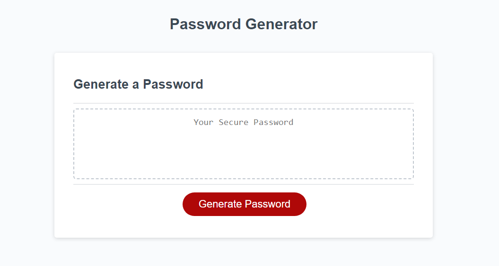
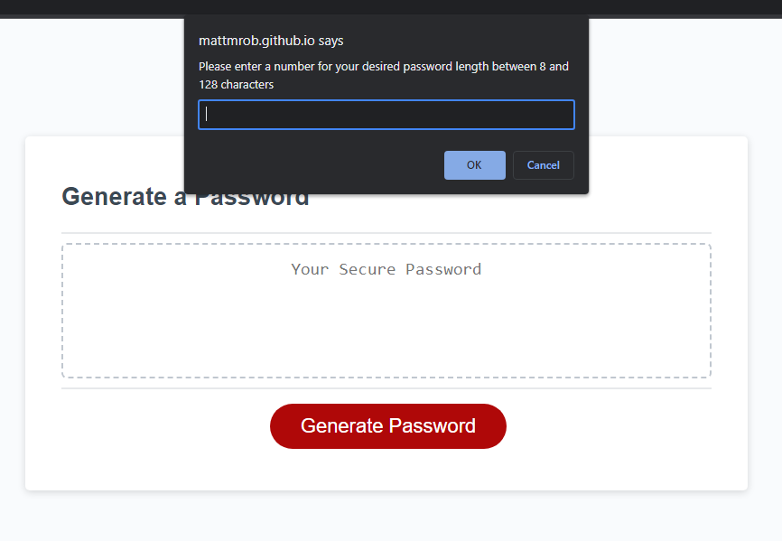
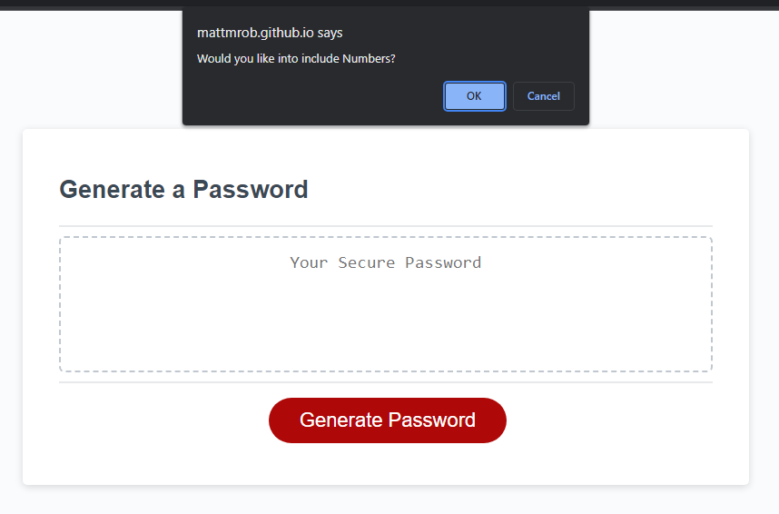
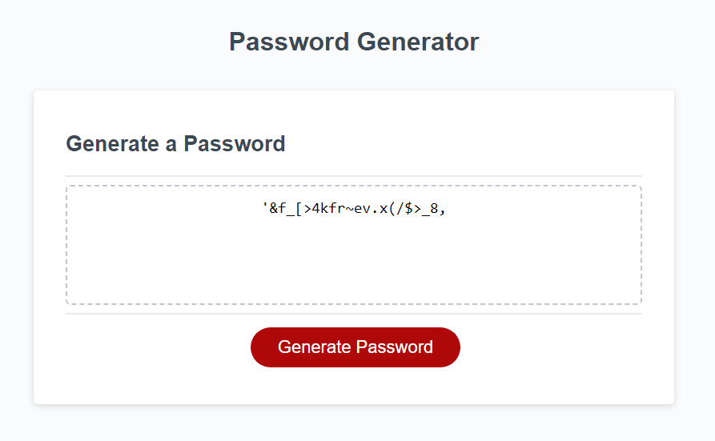

# PASSWORD GENERATOR

## Description

The goal of this project is to create a functional password generator for our client's site, which utilizes a series of prompts and confirms to produce a randomly generated password with the user's desired specifications.

## Installation

N/A

## Usage

The page can be found online through the following github pages link: https://mattmrob.github.io/Password-Generator/

By clicking on the 'Generate Password' button, the user will be given a prompt asking for a numerical value between 8 and 128, when a correct value is input, they will then be presented 4 confirms asking for lowercase, uppercase, numbers, or special characters to include in the password generation. Once the user has selected at least 1 of the four confirm options, a password will be generated using random characters from the selected options at the user's desired length. This password is displayed directly on the page for the user to copy or save.

## Credits

W3 Schools - for their excellent tutorials and guides
Dr. Derek Austin for their example on using .join() - https://medium.com/coding-at-dawn/how-to-convert-an-array-to-a-string-with-commas-in-javascript-79e212506c2

## License

MIT License